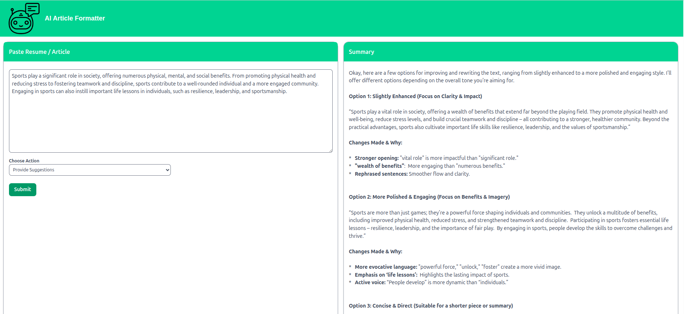

# AI Article/Resume Optimizer

A full-stack **MEAN** application that allows users to:
- **Format resumes** and **articles**
- Get smart **suggestions and improvements**
- **Match content** against given **keywords** (with score)
- Powered by locally running **Ollama (Gemma3:1b model)**

---
## UI


---

## Tech Stack

- **Frontend**: Angular + Tailwind CSS
- **Backend**: Node.js + Express
- **AI Engine**: [Ollama](https://github.com/ollama/ollama) with Gemma3:1b LLM
- **Database**: MongoDB (coming soon)
- **Containerized**: Docker + Docker Compose

---

## Features

| Feature | Description |
|--------|-------------|
| Format It | Improves structure and grammar of pasted resume/article |
| Provide Suggestions | Offers smart rewrites and improvements |
| Match Keywords | Checks how well the text matches input keywords |
| Streaming Response | See results appear live as AI thinks |
| API Logging | Stores inputs/responses in MongoDB *(in progress)* |

---

## 🗂️ Project Structure

ai-resume-optimizer/<br>
 ├── backend/ # Express API that connects to Ollama<br>
 ├── frontend/ # Angular + Tailwind UI<br>
 ├── ollama/ # Dockerfile and start.sh<br>
 ├── docker-compose.yml<br>
 └── README.md<br>

---

## 🐳 Getting Started (Docker)

> Ollama model will be downloaded once (~1-2GB) and cached for future use.

### 1. Clone and build

```bash
git clone https://github.com/your-username/ai-resume-optimizer.git
cd ai-resume-optimizer

# Start everything
sudo docker compose up --build
```

### 2. Access the app
- Frontend: http://localhost:4200
- Backend API: http://localhost:3000
- Ollama LLM: http://localhost:11500

### 3. API Reference
POST /v1/article

| Parameter | Type | Description |
|--------|-------------|---------------|
| text | string | Resume or article text |
|keywords|string|Comma-separated keywords|
|option|string|format, suggest, keywords|

#### Returns streamed JSON responses from Ollama.

#### Environment Variables
##### In docker-compose.yml:

- OLLAMA_URL=http://ollama:11434
PORT=3000
- AI Model: Gemma3:1b
- Ollama serves LLMs locally with GPU/CPU support

#### We use Gemma3:1b for fast and lightweight inference
##### To pull manually:
```bash
docker exec -it ollama ollama pull gemma3:1b
```

#### TODO
- MongoDB integration for storing history
- Add login/user tracking
- Export suggestions/download PDF
- Enhance LLM prompts


